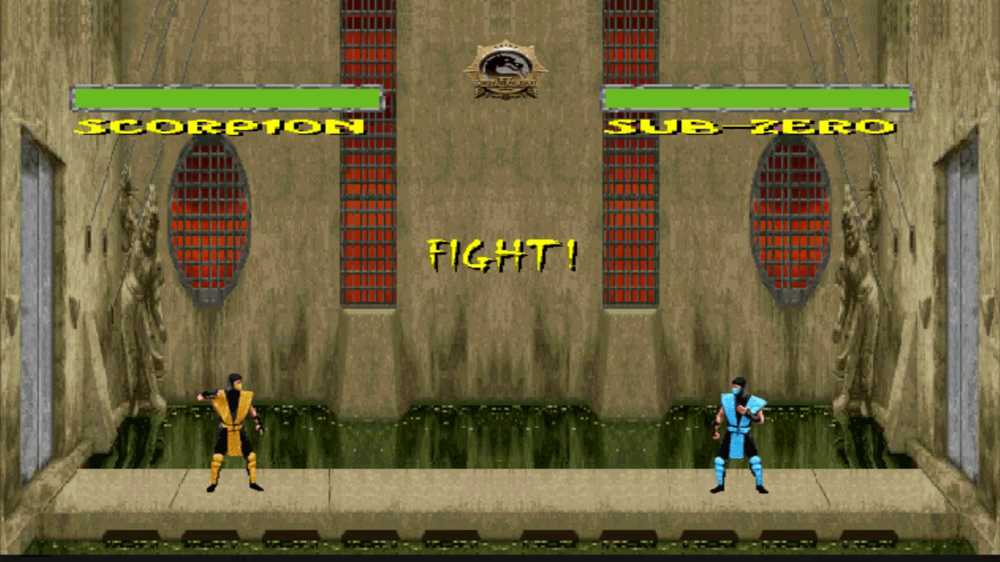

# Mortal-Kombat-C

About the game
==============
Mortal-Kombat-C is a small personal project based on the famous videogame. 
It was written in C using the SDL library.
The game was developed in short time, therefore there are no more complex features such as combos.
